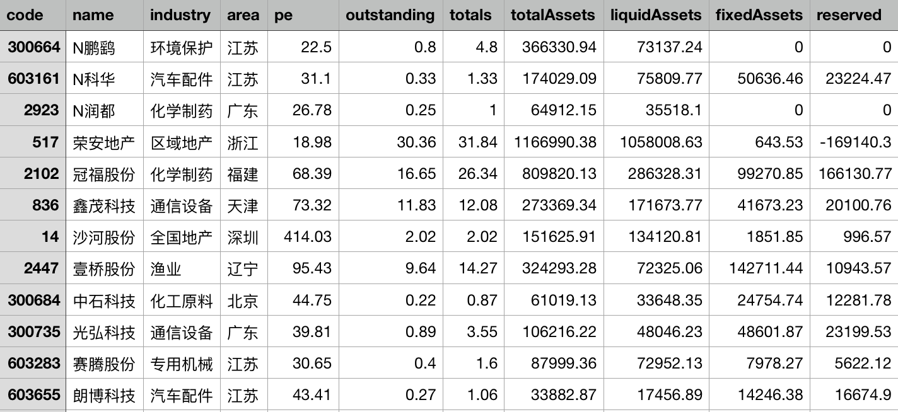
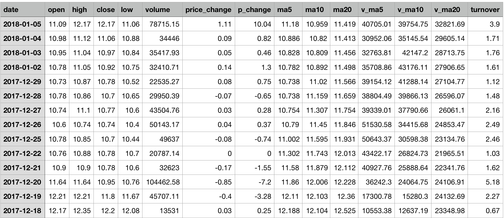

# 选股票系统
***
`实现思路`
做一个GUI界面  
获取一个类似于当日exal数据表单整合
成交量滑动条 范围0-max  
换手率滑动条 范围0-max  
当日收盘价滑动条 范围0-max  
上市日期滑动条 范围19970101-当日  
股东人数滑动条 范围0-max  
地区做一个筛选  
所属行业做一个筛选  
`使用的库`
python2.7，
numpy，
panda，
tushare  
`使用说明`  
  需要安装Tushare. 终端下执行pip install tushare
`项目逻辑`   
  程序使用tushare爬去基本面数据  
  然后根据基本面数据去爬取沪深A股过去一年的历史行情 
    
  先获取沪深A股票的所有code代码 
  然后通过[ts.get_hist_data()](http://tushare.org/trading.html#id2)获取分列过去一年的历史行情  
    
`项目文件说明`   
  [主要文件文件Demo.py](Demo.py)  
`外部API来源`  
  [Tushare来源](http://tushare.org "悬停显示")  
[回到顶部](#readme)	 
